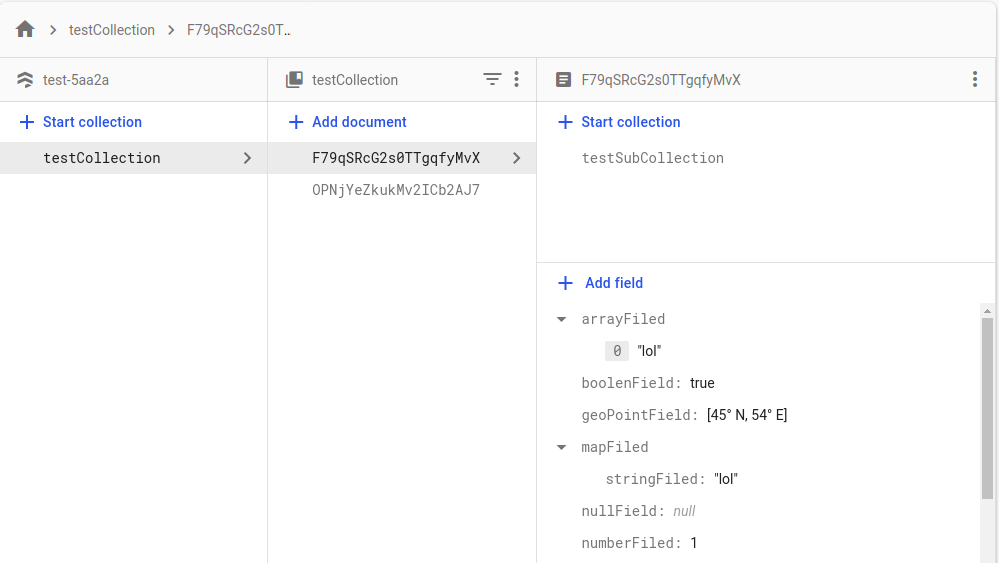

# Firebase/Firestore Schema Finder
 Since I asked this question [Database modeling to migrate to mongodb](https://stackoverflow.com/questions/72815824/database-modeling-to-migrate-to-mongodb).
 I got no answers so I started the hard way to find my project schema for each entity.

 Project is still under development and of course bug can be showen at any time :)



### Result is like that: 

```
{
    "testCollection/{document}/anotherSubCollection": {
        "anyField": "String"
    },
    "testCollection": {
        "stringFiled": "String",
        "nullField": "Null",
        "geoPointField": "GeoPoint",
        "arrayFiled": "Array",
        "boolenField": "Boolean",
        "numberFiled": "Integer",
        "refField": "Reference",
        "timestampFiled": "Timestamp",
        "mapFiled": "Map",
        "testField": "String",
        "anotherTestField": "String"
    },
    "testCollection/{document}/testSubCollection": {
        "testSubcollectionField": "String"
    },
    "testCollection/{document}/anotherSubCollection/{document}/subOfSubCollection": {
        "anyField": "String"
    }
}

```


 ## Known Issue:
 * The script takes too much time, this is becuase of db data, as the script loop on each document to find sub-collections 